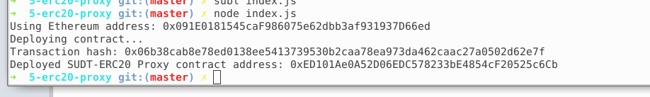
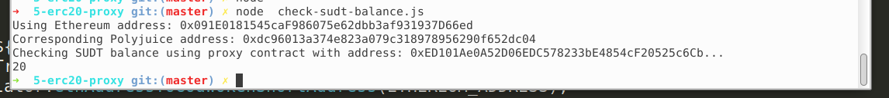

## A screenshot of the console output immediately after deploying smart contract.

## The address of the ERC20 Proxy Contract you deployed (in text format).

0xED101Ae0A52D06EDC578233bE4854cF20525c6Cb

## A screenshot of the console output immediately after checking your SUDT balance.

## The Ethereum address that was checked (in text format).

0x091E0181545caF986075e62dbb3af931937D66ed