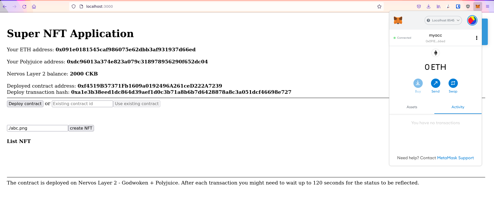

# TASK 7 

### 1- Screenshots and video of the application running on Godwoken

<

### 2- Project Github Link

<a href="https://github.com/quocson100/super-dapp"> GITHUB LINK</a>

### 3- The transaction hash of the deployment transaction, the deployed contract address, and the ABI of the deployed smart contract

Deploy transaction hash:

```bash
0xa1e3b38eed1dc864d39aef1d0c3b71a8b6b7d6428878a8c3a051dcf46698e727  
```

Deployed contract address:

```bash
0xf4519B57371Fb1609a0192496A261ceD222A7239 
```

ABI:

```javasctript
[
    {
      "inputs": [],
      "stateMutability": "nonpayable",
      "type": "constructor"
    },
    {
      "anonymous": false,
      "inputs": [
        {
          "indexed": false,
          "internalType": "uint256",
          "name": "id",
          "type": "uint256"
        },
        {
          "indexed": false,
          "internalType": "string",
          "name": "content",
          "type": "string"
        },
        {
          "indexed": false,
          "internalType": "uint256",
          "name": "tipAmount",
          "type": "uint256"
        },
        {
          "indexed": false,
          "internalType": "address payable",
          "name": "author",
          "type": "address"
        }
      ],
      "name": "PostCreated",
      "type": "event"
    },
    {
      "anonymous": false,
      "inputs": [
        {
          "indexed": false,
          "internalType": "uint256",
          "name": "id",
          "type": "uint256"
        },
        {
          "indexed": false,
          "internalType": "string",
          "name": "content",
          "type": "string"
        },
        {
          "indexed": false,
          "internalType": "uint256",
          "name": "tipAmount",
          "type": "uint256"
        },
        {
          "indexed": false,
          "internalType": "address payable",
          "name": "author",
          "type": "address"
        }
      ],
      "name": "PostTipped",
      "type": "event"
    },
    {
      "inputs": [],
      "name": "name",
      "outputs": [
        {
          "internalType": "string",
          "name": "",
          "type": "string"
        }
      ],
      "stateMutability": "view",
      "type": "function"
    },
    {
      "inputs": [],
      "name": "postCount",
      "outputs": [
        {
          "internalType": "uint256",
          "name": "",
          "type": "uint256"
        }
      ],
      "stateMutability": "view",
      "type": "function"
    },
    {
      "inputs": [
        {
          "internalType": "uint256",
          "name": "",
          "type": "uint256"
        }
      ],
      "name": "posts",
      "outputs": [
        {
          "internalType": "uint256",
          "name": "id",
          "type": "uint256"
        },
        {
          "internalType": "string",
          "name": "content",
          "type": "string"
        },
        {
          "internalType": "uint256",
          "name": "tipAmount",
          "type": "uint256"
        },
        {
          "internalType": "address payable",
          "name": "author",
          "type": "address"
        }
      ],
      "stateMutability": "view",
      "type": "function"
    },
    {
      "inputs": [
        {
          "internalType": "string",
          "name": "_content",
          "type": "string"
        }
      ],
      "name": "createPost",
      "outputs": [],
      "stateMutability": "nonpayable",
      "type": "function"
    },
    {
      "inputs": [
        {
          "internalType": "uint256",
          "name": "_id",
          "type": "uint256"
        }
      ],
      "name": "tipPost",
      "outputs": [],
      "stateMutability": "payable",
      "type": "function"
    }
  ],


```